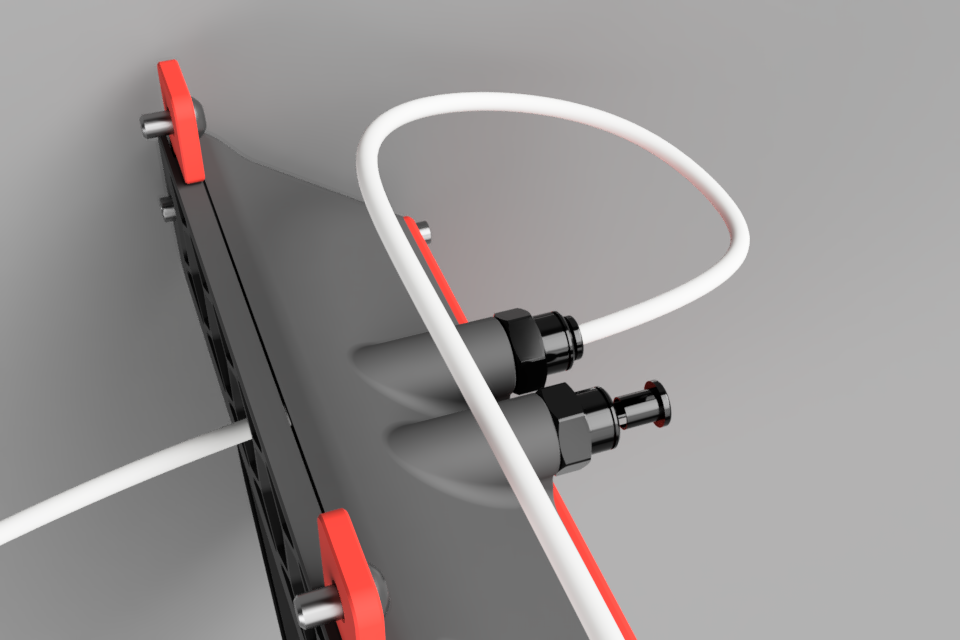
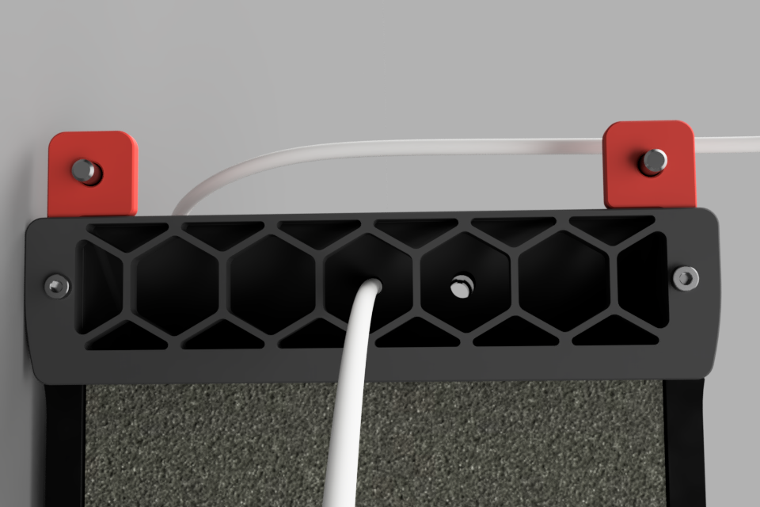

# Voron 2.4 Canbus Cable and Bowden Tube Integration

## Overview

This repository contains the necessary files to integrate the Canbus cable and Bowden tube in a cleaner and more efficient way for the **Voron 2.4** 3D printers. 
This  design ensures a neater setup by combining the routing of the Canbus cable and Bowden tube.

## Features

- **Dual Entry Ports:** Two adjacent holes have been designed to allow the Canbus cable and the Bowden tube to enter from above the printer.
- **Unified Routing:** The Canbus cable and Bowden tube are securely held together, eliminating the need for a steel wire guide.
- **Simplified Assembly:** This design reduces the complexity of assembly and the number of components needed for cable management.
- **Enhanced Aesthetics:** The integration of the Canbus cable and Bowden tube from above creates a cleaner look for the Voron 2.4 printer.

<table>
  <tr>
    <td>
      
    </td>
    <td>
      
    </td>
  </tr>
  <tr>
    <td>
      
    </td>
  </tr>

</table>

## Contributing

If you'd like to contribute to this project, please follow the [**Contributing Guidelines**](/CONTRIBUTING.md).

## License

This project is licensed under the [**GNU General Public License v3.0**](https://github.com/cristianku/VORON_2_CANBUS_BOWDEN/blob/main/LICENSE.txt), consistent with the Voron 2.4 project.
