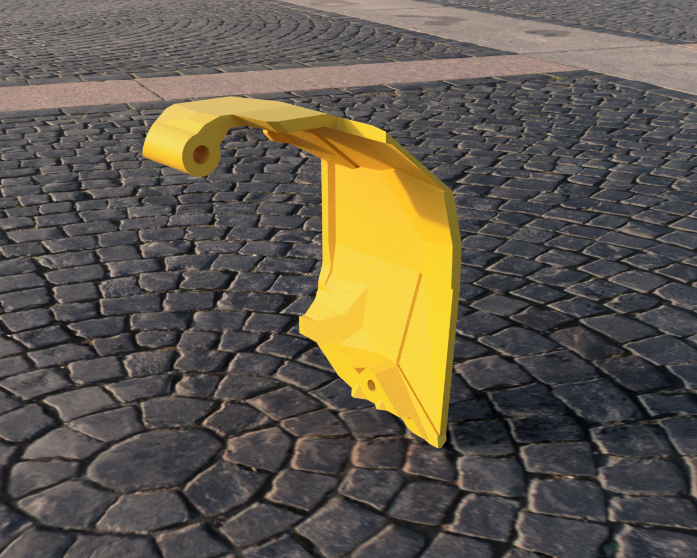

# Galileo 2 lid with more space
## A modified version of the original Galileo2 Lid, to make more space for the canbus connectors expecially of the RP2040 but also for SB2209.

[**Bigtreetech CANBUS cable Product Link**](https://biqu.equipment/products/bigtreetech-ebb-sb2209-can-v1-0?_pos=1&_sid=606ad3950&_ss=r&variant=40214282731618)

 

## I  have also an " aerated" version, trying to keep the canbus processor cooler

 
