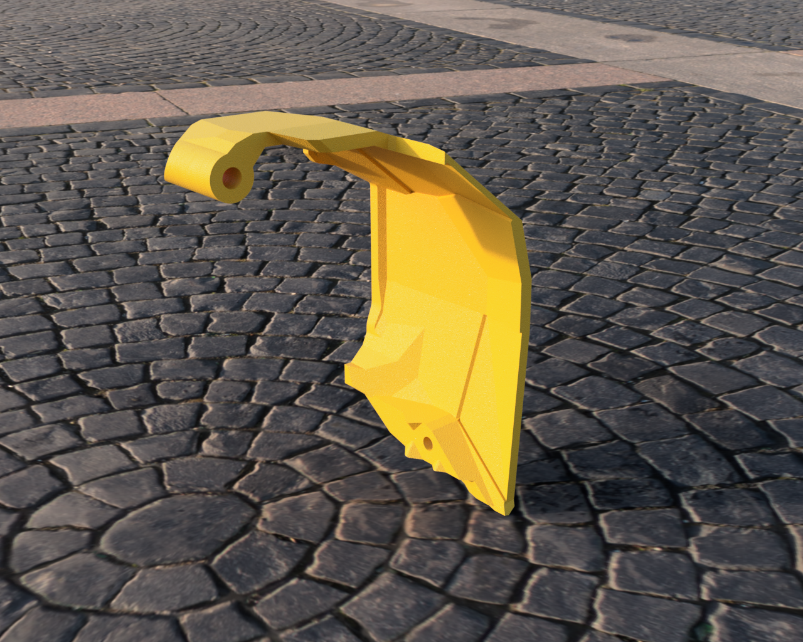
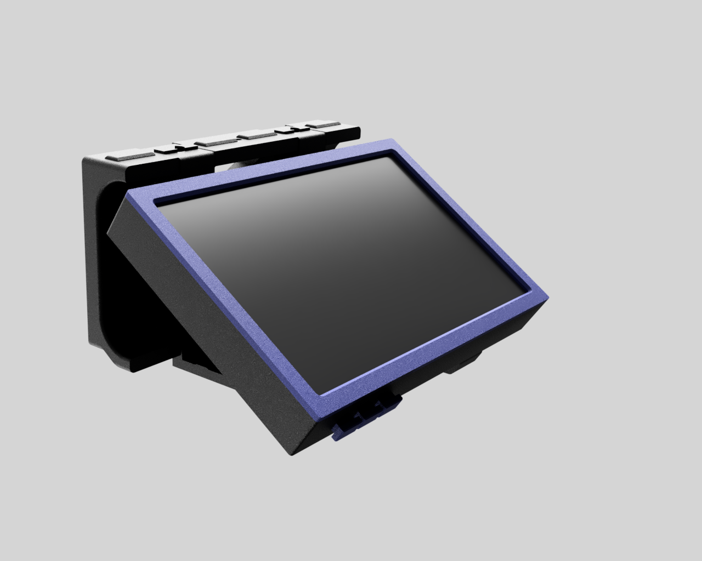
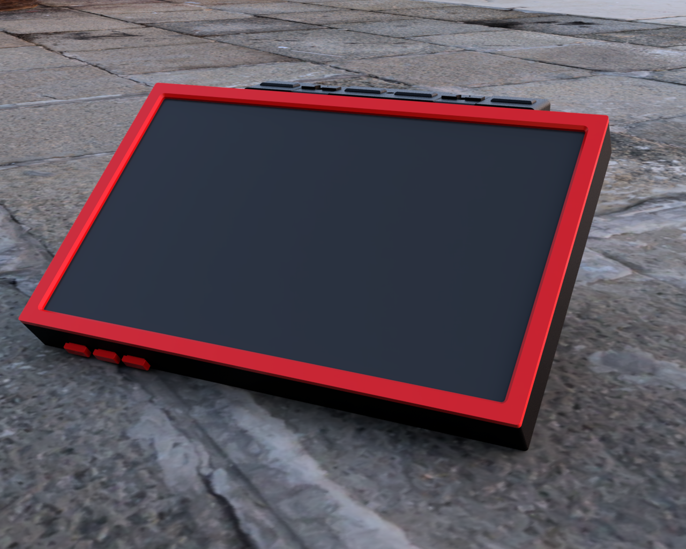
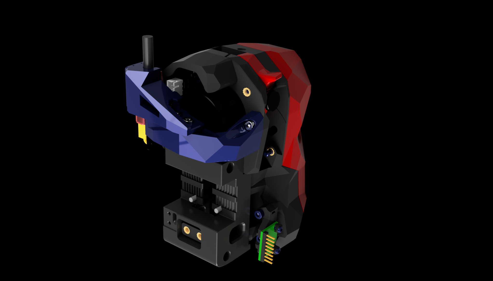
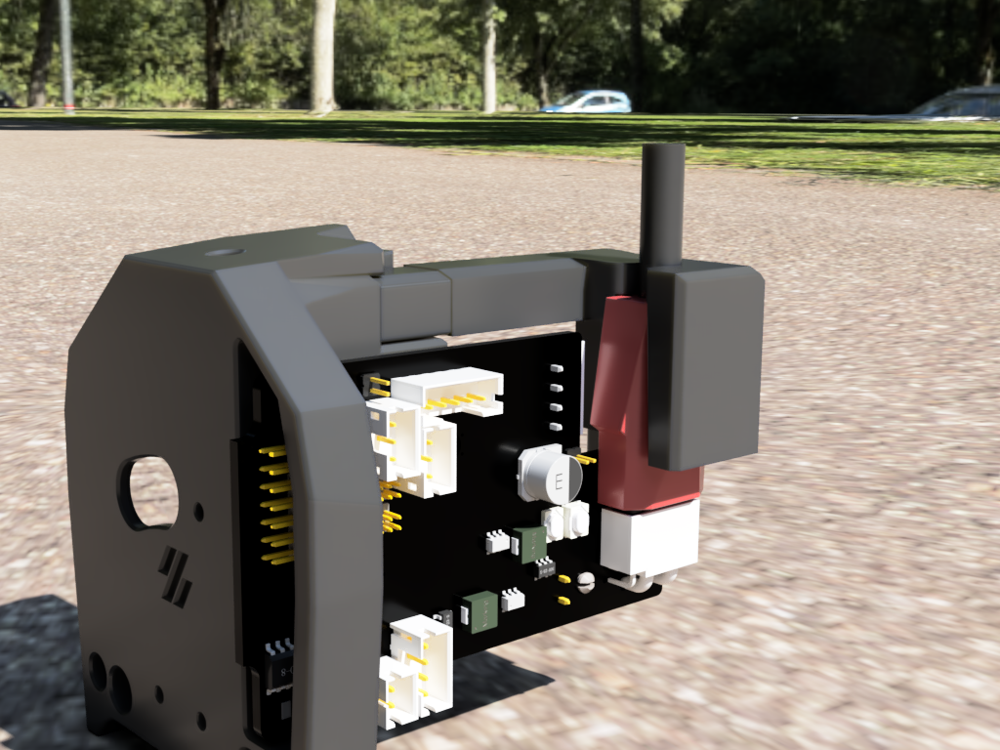
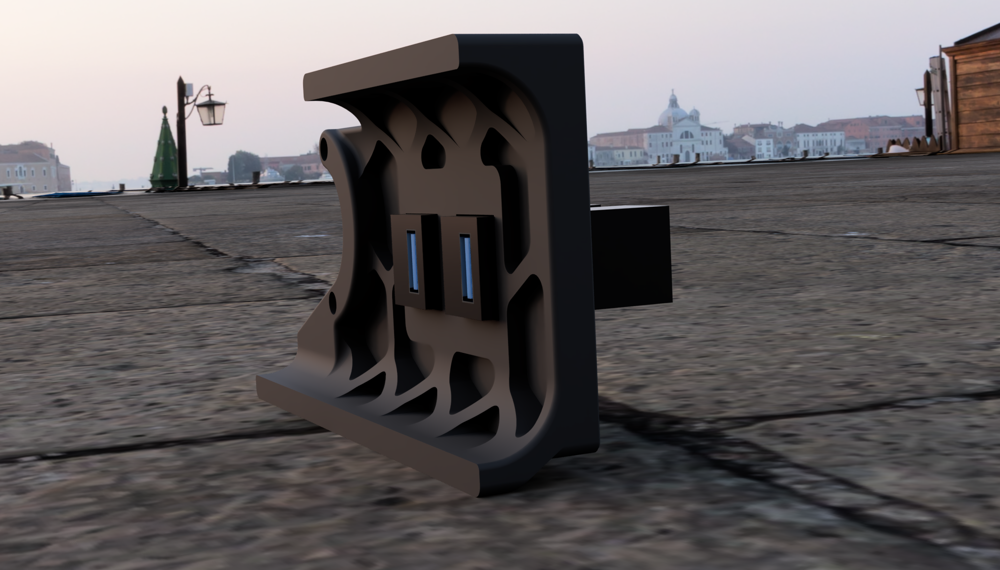
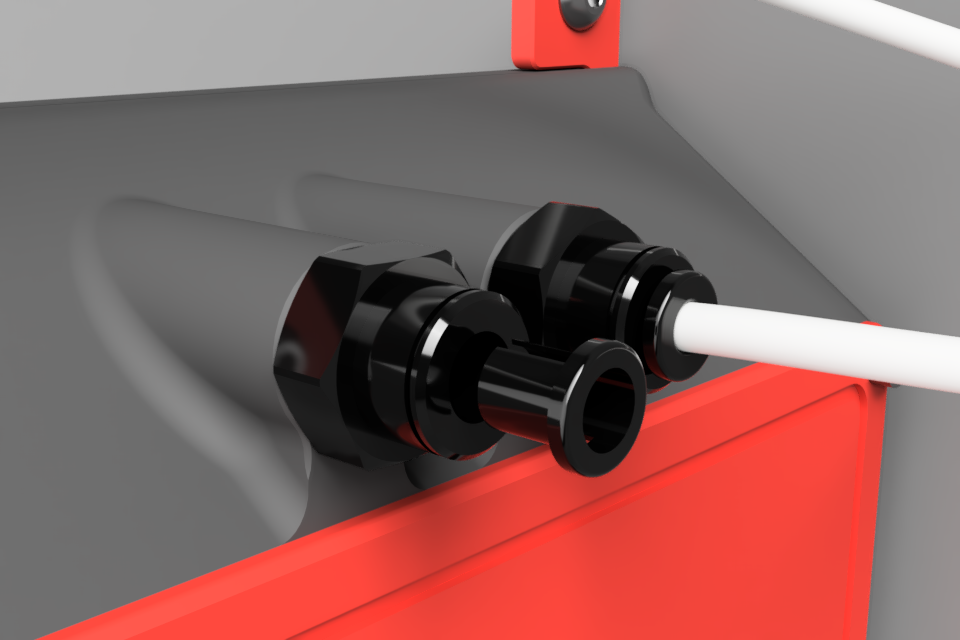

# Table of Contents

| Folder                           | Description                                                                                                                                              | Preview |
|----------------------------------|----------------------------------------------------------------------------------------------------------------------------------------------------------|---------|
| [Galileo2 Canbus Lid](./Galileo2_Canbus_Lid)       | A modified version of the original Galileo2 Lid, to make more space for the canbus connectors expecially of the RP2040 but also for SB2209. |  |
| [BTT_TFT_50](./BTT_TFT_50)       | A modified version of the TFT50 holder is now positioned lower, allowing for easier opening of the 3D printer doors. Additionally, there are external buttons for the TFT from BigTreeTech, enabling straightforward access to push the three buttons with ease. |  |
| [BTT_TFT_70](./BTT_TFT_70)       | A modified version of the TFT70 holder is now positioned lower, allowing for easier opening of the 3D printer doors. Additionally, there are external buttons for the TFT from BigTreeTech, enabling straightforward access to push the three buttons with ease. |  |
| [CW2_BTT_CANBUS](./CW2_BTT_CANBUS) | A Clockwork2 CANbus holder for BigTreeTech's SKR 2209 and RP2040, designed to accommodate the installation of all three different cable endings that come with these boards. |  |
| [GALILEO2_BTT_CANBUS](./GALILEO2_BTT_CANBUS) | A Galileo2 CANbus holder for BigTreeTech's SKR 2209 and RP2040, designed to accommodate the installation of all three different cable endings that come with these boards. |  |
| [SKIRT_KEYSTONE](./SKIRT_KEYSTONE) | A modified rear skirt designed to enable the correct insertion of Amazon USB keystones and LAN keystones without the need for superglue or other adhesives. |  |
| [CANBUS_CABLE_FROM_ABOVE](./CANBUS_CABLE_FROM_ABOVE) | A Modified way to "unbilical" the can bus cable, from above, together with the bowden tube. |  |
